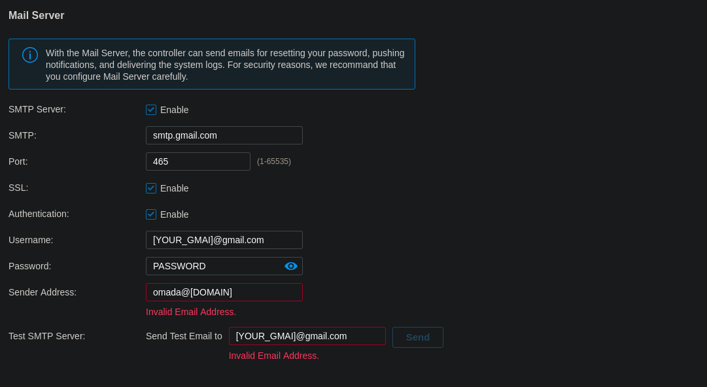

In order to get proper email notifications from the TP-link Omada SDN Controller you need to set up SMTP and have it authenticate to your email provider of choice (here we're gong to use gmail). This tutorial is assuming that you have a google domain because you use the google SMTP servers to send your mail. Gmail allows application access to SMTP functions pretty seamlessly so this whole evolution takes like 5 mins.

### Email Application Setup
1. To start, go to the Google applications dashboard: https://myaccount.google.com/
2. Next click the Security tab then go to Signing in to Google > App Passwords
3. You will most likely be asked to re-authenicate, but from there you will Click the Select app dropdown and select Mail.
4. Then in the Select device dropdown click other
5. Give it a name you will remember, something like: [DOMAIN] (Omada).
### Omada SMTP Setup
6. From there in the Omada SDN Controller go to Settings > Controller > Mail Server and enable the mail server.
7. From there fill out the fields as such and test your configuration:

**Port**: This should be 465 if you are using SMTP over TLS.

**SSL**: Always use SSL.

**Authentication**: Authentication is required to use google SMTP servers.

**Username**: This is the gmail account you used to create the app password.

**Password**: This is the app password generated in the previous step

**Sender Address**: This is the custom address you would like to send the email from.