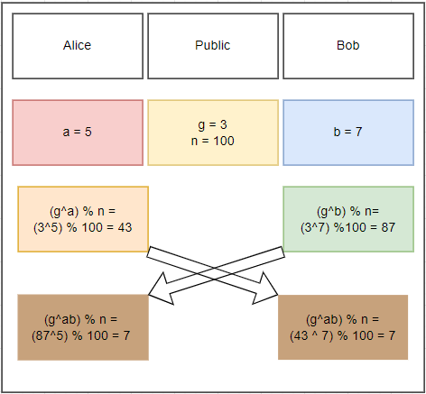

Today I was looking into some stuff for SSH and I wanted to know more about the maths behind how diffie helman works and since its just always something I took for granted so today I learned. Below is a simple graphic that I made that illustrates the process of the key exchange.  

So what does this mean? Well asymetric cryptography is built upon the idea of creating a shared secret independently without passing it over the public internet. Diffie-Helman arised as a method of doing so. So how does this work you ask? Our first subject Alice comes up with a random number, for illustration purposes this number is small, but his is usually a very large number. Bob indenpendently does the same, both of these numbers are unique and never shared and will be regfered to as a private key. What is shared are two other numbers g and n, these numbers can be whatever as long as g is small and prime and n is very large. These numbers will be used in a mathematcal function to create something they can share, a piblic key. This public key can easily be derived if you have the private key, but the math doesnt work that well the other way around, this is due to the modulus operation. Modulus is simply the remander left over after a number is divided into another one evenly as many times as possibly. It is improbable for me to know how many times the number fit into the other one cleanly with just the remainder without simply guessing every possibility. If our private keys and n operator are large enough, this will again be very impractical. The colors here are to represent that our numbers as they are combined. While I know that yellow is in the public domain and alice's public key is orange, i dont know the exact shade of red or quantity that she used to make this orange which would make it very difficult to replicate without trial and error. 

Now that we have established both public and private keys, our partiies can exchange their public keys and add their private keys to the result with the same method used to create the public keys. The result should independently create the same key, which is apparent as both users have arrived to the number 7 and the color brown. As the numbers increase in size, the likelyhood that the symetric key will be the same as a user's private key decreases as well.