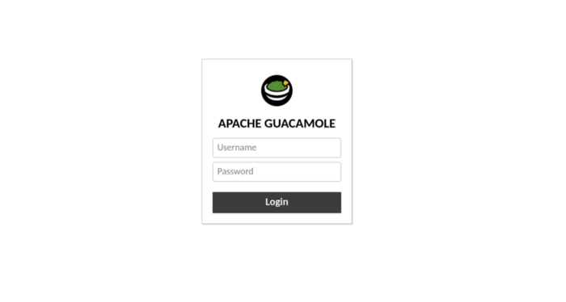

Do you ever find yourself wanting to access machines, but due to the permissions of he computer you're currently on or network restrictions you're unable to do so? Or maybe you have users that you would like to have access to remote machines, but you don't want to have to worry about what remote administration tools they have on their devices. Guacamole is cool because it allows a user to access Windows and Linux machines through a variety of different protocols such as SSH, RDP, or VNC through a web browser as all of the tools are separated from the client machine and resident on the server side meaning administration can be done on any computing device capable of web browsing to prove it, once we have this set up i will access a remote machine via my PlayStation 4. I’m a huge fan of web apps and this is one of my favorites so today I’m gonna show you how to set it up.
## Setup Options

Like many thing in computers there’s many ways to get this installed on your computer. Usually I’m a huge fan of containerized applications for a number of different reasons, and there are a few container images that have everything already set up and simply require a docker pull, a popular one being the [onzu image](https://hub.docker.com/r/oznu/guacamole). Another popular installation method is via the popular [MysticRyuujin shell script](https://github.com/MysticRyuujin/guac-install) which is mainly geared towards Ubuntu systems. Finally the easiest method in my opinion is by using the one click installation available on some of the VPS providers. The Linode on is pretty good and they have a [YouTube video](https://www.youtube.com/watch?v=W2zEn1p7Nt4&t=140s) to walk you through the process from start to finish. We will not be using any of these methods, Today were gonna do a straight up build from source on an Ubuntu 20.04LTS server.
## Server Setup

Unfortunately the Guac Ubuntu ppa is not a good option even though it is the preferred method on the official site, so we are gonna build it from source. To begin we’re gonna need to install all of the dependencies listed here. Some of these (like gcc) will already be installed, but just include everything to be sure.
```
sudo apt install -y gcc g++ libcairo2-dev libjpeg-turbo8-dev \

libpng-dev libtool-bin libossp-uuid-dev libavcodec-dev \

libavutil-dev libswscale-dev freerdp2-dev libpango1.0-dev \

libssh2-1-dev libvncserver-dev libtelnet-dev libssl-dev \

libvorbis-dev libwebp-dev freerdp2-x11 openjdk-11-jdk-y
```
## Installing Tomcat

In order to actually run the Java resources we will need to install Apache Tomcat, which will allow us an environment to run the Java code via in an HTML environment. To begin we’re going to fetch the tomcat source code and the associated checksum.
```
wget https://downloads.apache.org/tomcat/tomcat-9/v9.0.50/bin/apache-tomcat-9.0.50.tar.gz

wget https://downloads.apache.org/tomcat/tomcat-9/v9.0.50/bin/apache-tomcat-9.0.50.tar.gz.sha512

sha512sum apache-tomcat-9.0.50.tar.gz.sha512
```
Afterwards we’re going to create a tomcat user to interact with the service to ensure security and mitigate any damage in the case your server is compromised via the web app (safety first). Then we’re going to simply put our files in a standard directory location and transfer ownership to our tomcat user and ensure the scripts have the appropriate execute permissions.
```
sudo mkdir /opt/tomcat

sudo tar -xzf apache-tomcat-9.0.50.tar.gz -C /opt/tomcat/

sudo mv /opt/tomcat/apache-tomcat-9.0.50 /opt/tomcat/tomcatapp

sudo chown -R tomcat: /opt/tomcat

sudo chmod +x /opt/tomcat/tomcatapp/bin/*.sh
```
Now we’re going to manually create a tomcat service which will allow it to be started via systemd.
```
sudo cat > /etc/systemd/system/tomcat.service << EOF


[Unit]

Description=Tomcat 9 servlet container

After=network.target


[Service]

Type=forking


User=tomcat

Group=tomcat


Environment="JAVA_HOME=/usr/lib/jvm/java-11-openjdk-amd64"

Environment="JAVA_OPTS=-Djava.security.egd=file:///dev/urandom -Djava.awt.headless=true"


Environment="CATALINA_BASE=/opt/tomcat/tomcatapp"

Environment="CATALINA_HOME=/opt/tomcat/tomcatapp"

Environment="CATALINA_PID=/opt/tomcat/tomcatapp/temp/tomcat.pid"

Environment="CATALINA_OPTS=-Xms512M -Xmx1024M -server -XX:+UseParallelGC"


ExecStart=/opt/tomcat/tomcatapp/bin/startup.sh

ExecStop=/opt/tomcat/tomcatapp/bin/shutdown.sh


[Install]

WantedBy=multi-user.target

EOF
```
Now you simply reload systemd and start/enable your service.
```
sudo systemctl daemon-reload

sudo systemctl start tomcat

sudo systemctl enable tomcat
```
## Installing Guacamole Server

Now youre going to want to pull both the source file and its associated md5 checksum and verify everything downloaded correctly.
```
wget https://downloads.apache.org/guacamole/1.3.0/source/guacamole-server-1.3.0.tar.gz \

wget wget https://downloads.apache.org/guacamole/1.3.0/source/guacamole-server-1.3.0.tar.gz.md5 \

md5sum -c guacamole-server-1.3.0.tar.gz.md5
```
If everything downloaded correctly should get the following output guacamole-client-1.3.0.tar.gz: OK

Next we need to extract the archive so that we can actually begin building and then we’ll run the configure script to ensure all the necessary packages are in place and prepare it to be built. Then we will compile and install the package. And finally make sure we have the correct shared library links/cache in order.
```
tar xvf guacamole-server-1.3.0.tar.gz

cd guacamole-server-1.3.0/

./configure --with-init-dir=/etc/init.d

make

sudo make install

sudo ldconfig
```
Again, were going to reload systemd and start/enable our service
```
sudo systemctl start guacd

sudo systemctl enable guacd
```
## Installing the Guacamole Client

As you may recall earlier we installed the Tomcat serverlet container to allow us to run the client Java code in our browser. Now we’re going to actually download that client then create a sym-link in the Tomcat webapps directory.
```
sudo mkdir /etc/guacamole

wget https://downloads.apache.org/guacamole/1.3.0/binary/guacamole-1.3.0.war

wget https://downloads.apache.org/guacamole/1.3.0/binary/guacamole-1.3.0.war.md5

md5sum guacamole-1.3.0.war

sudo mv ./guacamole-1.3.0.war /etc/guacamole/guacamole.warsudo ln -s /etc/guacamole/guacamole.war /opt/tomcat/tomcatapp/webapps
```
## Post Installation Configuration

Now that everything is installed we need to do a couple things, first we’re gonna create an environmental variable to define the Guac home directory so that tomcat knows where to look.
```
echo "GUACAMOLE_HOME=/etc/guacamole" | sudo tee -a /etc/default/tomcat
```
Now we’re gonna create the rules for how the guac client and server interact with one another. This is done using the guacamole.properties file.
```
sudo cat > /etc/guacamole/guacamole.properties << EOF

guacd-hostname: localhost

guacd-port:    4822

user-mapping:    /etc/guacamole/user-mapping.xml

auth-provider:    net.sourceforge.guacamole.net.basic.BasicFileAuthenticationProvider

EOF

sudo ln -s /etc/guacamole /opt/tomcat/tomcatapp/.guacamole
```
## Authentication

By default Guac authenticated via a “user-mapping.xml” passwords can be md5hashed and stored within the configuration file which is preferable to storing it in plaintext.
```
<user-mapping>

	

   <!-- Per-user authentication and config information -->

   <authorize username="USERNAME" password="PASSWORD">

       <protocol>vnc</protocol>

       <param name="hostname">localhost</param>

       <param name="port">5900</param>

       <param name="password">VNCPASS</param>

   </authorize>


   <!-- Another user, but using md5 to hash the password

        (example below uses the md5 hash of "PASSWORD") -->

   <authorize

           username="USERNAME2"

           password="319f4d26e3c536b5dd871bb2c52e3178"

           encoding="md5">


       <!-- First authorized connection -->

       <connection name="localhost">

           <protocol>vnc</protocol>

           <param name="hostname">localhost</param>

           <param name="port">5901</param>

           <param name="password">VNCPASS</param>

       </connection>


       <!-- Second authorized connection -->

       <connection name="otherhost">

           <protocol>vnc</protocol>

           <param name="hostname">otherhost</param>

           <param name="port">5900</param>

           <param name="password">VNCPASS</param>

       </connection>


   </authorize>


</user-mapping>
```
Other options for your user-mapping.xml file such as RDP options and ssh options can be found here. Lastly make sure to restart both tomcat and guacamole and test your login
```
sudo systemctl restart tomcat guacd
```
Your web-app should be accessible via http://\<IP\>:8080/guacamoleand your login should look like this.
