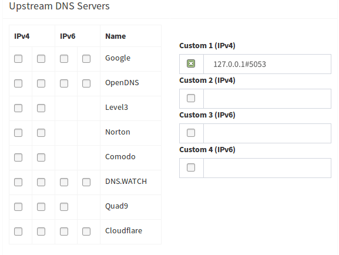
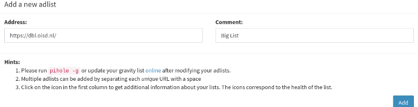

Everyone hates advertisements and thanks to the raspberry pi and the Pi-hole project, keeping them out of your life has become easier and easier. By setting up a local Domain Name Service(DNS) server you can block the connection to add servers before they’re even initiated. Pi-hole also presents the user with a beautiful user interface and is easily configured for even the newest of IT enthusiasts (I'm serious, its like… one command.)

## Installing Pi-hole

There are a few ways to install Pi-hole, the simplest is using the “One step automated install” which is composed of pulling the install script directly from Pi-hole and redirecting it to your shell.

```
curl -sSL https://install.pi-hole.net | bash
```

Many people are a bit weary with running random scripts from a webpage directly into their shell, which is okay, there's still the option to clone the github repo and run the install script from there.

```
git clone --depth 1 https://github.com/pi-hole/pi-hole.git Pi-hole
cd "Pi-hole/automated install/"
sudo bash basic-install.sh
```

**note** if youre using any operating system that isnt Debian based such as Raspberry Pi OS or Ubuntu, i recommend that you run the container instead. It can be found here in the [Docker Hub](https://hub.docker.com/r/pihole/pihole).

## DoH
DNS over HTTPS is simply a protocol that allows you to perform DNS lookups via the HTTPS protocol. The method we will be using to do so is the Cloudflare Argo Tunnel Client: Cloudflared. Many people have their own opinions on cloud flare, but ill let you form those on your own. Cloudflared is a completely open source project and if you would like to audit the code you can find it here. I like them. Disclaimer, installing via this method will be running cloudflared as root, so take that into consideration for your risk profile.

The instructions to install Cloudflared can be found at https://pkg.cloudflare.com/index.html but the current instructions for Debian bullseye are as follows. 

```
# Add cloudflare gpg key
sudo mkdir -p --mode=0755 /usr/share/keyrings
curl -fsSL https://pkg.cloudflare.com/cloudflare-main.gpg | sudo tee /usr/share/keyrings/cloudflare-main.gpg >/dev/null

# Add this repo to your apt repositories
echo 'deb [signed-by=/usr/share/keyrings/cloudflare-main.gpg] https://pkg.cloudflare.com/cloudflared bullseye main' | sudo tee /etc/apt/sources.list.d/cloudflared.list

# install cloudflared
sudo apt-get update && sudo apt-get install cloudflared

# Confirm Install
cloudflared --version
```

The Default configuration for cloudflared should be fine in order to get it running to do DoH via the default 1.1.1.1 and 1.0.0.1 DNS servers

```
$ sudo tee /etc/systemd/system/cloudflared-proxy-dns.service >/dev/null <<EOF

[Unit]
Description=DNS over HTTPS (DoH) proxy client
Wants=network-online.target nss-lookup.target
Before=nss-lookup.target


[Service]
AmbientCapabilities=CAP_NET_BIND_SERVICE
CapabilityBoundingSet=CAP_NET_BIND_SERVICE
DynamicUser=yes
ExecStart=/usr/local/bin/cloudflared proxy-dns --port 5053


[Install]
WantedBy=multi-user.target
EOF
```

And to enable and immediately start the service, you can just run.

```
sudo systemctl enable --now cloudflared-proxy-dns
```

From here you should simply change your default DNS server by modifying the /etc/resolv.conf file to your localhost which will be proxied by the cloudflared service, the following commands should do what you need. 

```
sudo rm -f /etc/resolv.conf
echo nameserver 127.0.0.1 | sudo tee /etc/resolv.conf >/dev/null
```

If you would like to test to make sure everything is good you can run a dig command such as `dig @127.0.0.1 -p 5053 google.com`, and get a return similar to this.

```
; <<>> DiG 9.16.33-Debian <<>> @127.0.0.1 google.com
; (1 server found)
;; global options: +cmd
;; Got answer:
;; ->>HEADER<<- opcode: QUERY, status: NOERROR, id: 25487
;; flags: qr rd ra; QUERY: 1, ANSWER: 6, AUTHORITY: 0, ADDITIONAL: 1


;; OPT PSEUDOSECTION:
; EDNS: version: 0, flags:; udp: 4096
;; QUESTION SECTION:
;google.com.                    IN      A


;; ANSWER SECTION:
google.com.             179     IN      A       142.251.163.139
google.com.             179     IN      A       142.251.163.101
google.com.             179     IN      A       142.251.163.138
google.com.             179     IN      A       142.251.163.102
google.com.             179     IN      A       142.251.163.113
google.com.             179     IN      A       142.251.163.100


;; Query time: 0 msec
;; SERVER: 127.0.0.1#53(127.0.0.1)
;; WHEN: Sun Feb 12 14:42:36 UTC 2023
;; MSG SIZE  rcvd: 135
```

Now that we got that going, we can go back to out Pi-hole client and configure all DNS lookups that the server performs to do so via this method via disabling the default upstream DNS Providers and setting resolution to localhost which is ultimately proxied through the Cloudflare network.

Go to Settings > DNS and do the follwoing:



The advantage of doing this via the package manager method instead of getting the binary from github is that updates can be pulled from the repos along with the rest of your updates. and you don't need to use chrons or anything. 

### DNSCrypt

If you want to take your privacy a step forward and use anonymized DNS. DNS crypt provides a service that proxies your queries through unwitting DNS relays. These relays do not have the appropriate information to decrypt your queries to see the content, they only serve as a middle man so that your ultimate DNS provider cant tie the content queried to the intiating IP. This is a lot simpler and faster than the DNS over TOR (SOCKS) clients a lot of privacy-focused services use and its useful if you like the service Cloudflare provides, but you dont trust them to be responsible with your data. Setup is quite easy if you follow the steps outlined in the Cloudflare docs. 

To install on debian, the package is already included in the standard repo so installation is possible via 
```
sudo apt install dnscrypt-proxy
```
\<IN progress\>

## Denylists

Now the default Pi-hole blacklists are alright, but i typically add one extra list (its a pretty big list) and it does a great job of mitigating ads as much as possible.

Go to Group Management > Adlists and add https://dbl.oisd.nl/ to your adlists.

Afterwards it a good idea to go to Tools > Update Gravity in order to update your total blocked sites.
## Regex

It’s a good idea to enhance your Blacklists with powerful regex that can widen your net of ads to catch. you can do so by downloading and running the pihole-regex python script provided by mmotti via.
```
curl -sSl https://raw.githubusercontent.com/mmotti/pihole-regex/master/install.py | sudo python3
```

to keep your regex up to date you can add the following lines to root’s crontab
```
SHELL=/bin/bash
PATH=/usr/local/sbin:/usr/local/bin:/sbin:/bin:/usr/sbin:/usr/bin
30 2 * * 1 /usr/bin/curl -sSl https://raw.githubusercontent.com/mmotti/pihole-regex/master/install.py | /usr/bin/python3
```
## Allowlists

Lastly we’ll add a list of commonly allowlisted domains so that you aren't running into the same issues as I did when I had to go into Pi-Hole at least once a week and allowlist something I needed (none of the domains in this allowlist contain trackers or ads).
```
curl -sSL https://github.com/anudeepND/whitelist/blob/master/scripts/whitelist.py | sudo python3
```
To auto update, just like the previous services we’re going to edit root’s crontab with the following line
```
30 2 * * 1 /usr/bin/curl -sSl https://raw.githubusercontent.com/anudeepND/whitelist/master/scripts/whitelist.py | /usr/bin/python3
```